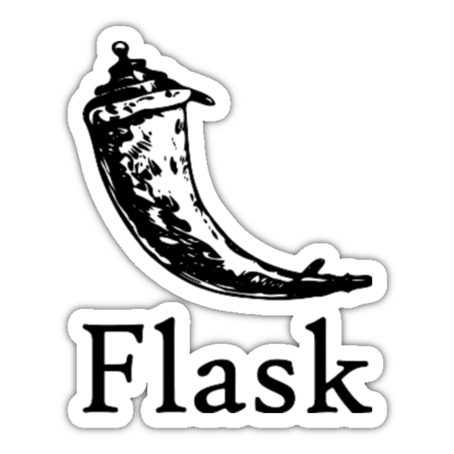

## About Flask

- Flask is a microframework that ships with minimal dependencies. To build websites, Flask has features like debugging servers, routing, templates, and error handling. Flask can be installed as a python package. Django is a full-stack framework compared to Flask. You can create a server by instantiating the Flask class.

- Flask provides a Request and a Response object for each client call. You can get additional information from the Flask Request, like headers. You can parse the Request Object to get query parameters, body, and other arguments. You can even set status on Response objects before sending a response back to the client.

- Python libraries are like toolkits. Each library has specific tools to simplify and expedite certain programming tasks. Frameworks are predefined structures for application development. Framework enables you to build the complete application, while libraries aid with specific functionality.

- You can use dynamic routes to create RESTful endpoints.

- There are multiple classes of HTTP status codes showing success, user error, or server error. Flask implicitly returns a success code of 200 with the response. You can also provide status codes explicitly. Flask also provides application-level error handlers.

- Flask is a microframework for creating web applications and supports CRUD.

## Run Flask

- Install the Flask package using pip.
  - `pip install flask`  

- To create a web application using Flask:

- Import Flask
   - `from flask Import Flask`

- Instantiate Flask 
  
- Run the app

- You can render both static and dynamic templates with Flask.
- You Done It
